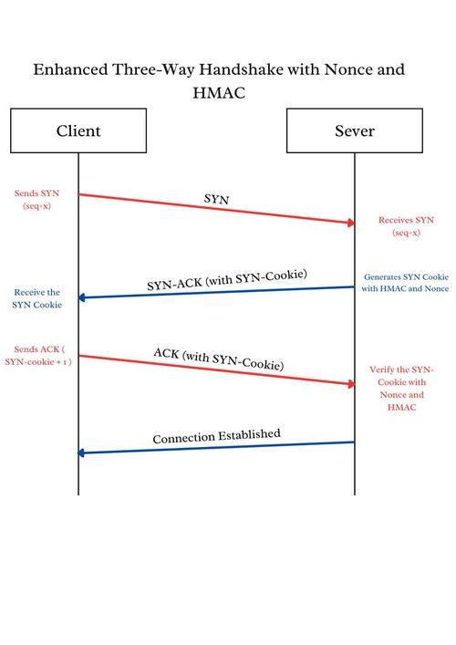

#NOxSYN Simulator

NOxSYN Simulator is an educational tool designed to demonstrate an enhanced SYN cookie mechanism that resists SYN flooding attacks using a cryptographically secure nonce and HMAC. The simulator includes a menu-driven interface for starting the server, launching a SYN flood attack, initiating a legitimate TCP handshake, analyzing traffic, and monitoring behavior under denial-of-service conditions.

---

##  Features

- **Start SYN Cookie Server**: Listens for SYN requests and replies with HMAC + Nonce-based SYN cookies.
- **Run Legitimate Client**: Sends a proper SYN and completes the three-way handshake using enhanced cookies.
- **Launch SYN Flood**: Simulates a SYN flood attack with multithreading to mimic a realistic distributed DoS scenario.
- **Ping a Target IP**: Useful for verifying network reachability.
- **Show Host IP Address**: Displays the local IP address for server/client config.
- **Analyze PCAP**: Parses .pcap files to verify SYN cookie validation.
- **Run Nmap Scan**: Integrates basic Nmap scanning to probe open ports and services on a target for situational awareness during testing.
---

##  Educational Purpose

This tool is meant for cybersecurity students, researchers, and hobbyists looking to better understand:

- Stateless SYN cookie-based defense
- TCP handshake analysis
- SYN flooding detection
- PCAP-level validation of cookies

---

##  Environment Setup

- **Python Version**: 3.10+
- **Libraries**:
  - `scapy`
  - `socket`
  - `hmac`
  - `hashlib`
  - `os`, `signal`, `subprocess`, `datetime`, `random`, `threading`, `time`

> Two Kali Linux VMs were used on the same host: one acted as the server, and the other simulated both the client and the attacker roles.

---

##  How the Method Works

This simulator uses an HMAC-based SYN cookie computation of the form:

```python
SYN_Cookie = HMAC(Secret_Key, Client_IP || Client_Port || Timestamp || Nonce)
```
- Server remains **stateless**
- Nonce prevents **replay attacks**
- Cookie verified upon **ACK** reception
- No server-side memory allocation before full handshake




##  Usage Instructions

# Clone 
```
https://github.com/yourusername/SYNGuard-Simulator.git
```
# Navigate
```
cd SYNGuard-Simulator
```
# Start the main menu
```
sudo python3 sim.py
```
##  Note on SYN Flooding Simulation
Instead of sending a fixed number of packets, our SYN flooding module uses multiple threads to simulate concurrent connection attempts—this approach better mimics a real-world DoS scenario where numerous machines or bots flood a server simultaneously. Thread-based simulation increases CPU/memory pressure on the server more realistically than simple looped packet spamming.

##  Directory Structure
```
SYNGuard-Simulator/
├── sim.py               # Main launcher and interactive menu
├── Ourmethodology.png   # Diagram of enhanced TCP handshake
└── README.md
```

##  NOTE:
If you're running this on a Linux system and want to avoid interference from the kernel's own SYN cookie mechanism, you can temporarily disable it using the following command:
```
sudo sysctl -w net.ipv4.tcp_syncookies=0
```
To re-enable it after testing:
```
sudo sysctl -w net.ipv4.tcp_syncookies=1
```
To check current status:
```
sysctl net.ipv4.tcp_syncookies
```
##  Authors
Haifa Nasser, Layan Alsuliman
